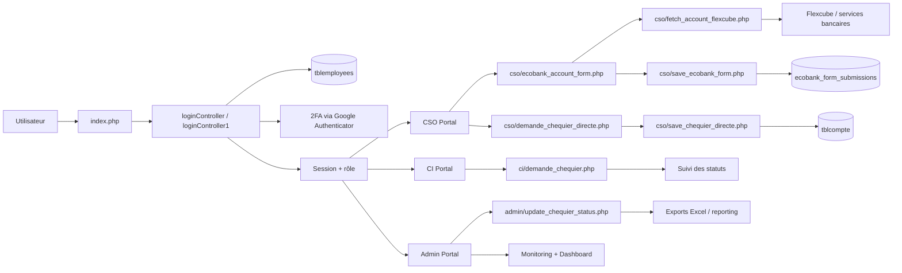

# AO & KYC - E-Agency Ecobank

Projet web PHP pour la gestion du parcours d’ouverture de compte et des demandes de chéquier au sein d’Ecobank Congo. Il centralise l’authentification, la collecte de données, la recherche bancaire via Flexcube, le suivi métier, la génération de documents et l’export de rapports.

Ce document est conçu pour qu’une personne qui découvre le projet puisse comprendre rapidement :
- le but du système,
- les rôles utilisateurs,
- les flux principaux,
- les fichiers clés,
- les prérequis techniques,
- le mode de fonctionnement en local ou via Docker.

---

## 1. Vue d’ensemble

Le projet est une application de type portail interne pour la gestion administrative et commerciale de l’agence.

Il couvre principalement trois domaines :
- ouverture et suivi des comptes clients,
- demande et gestion de chéquier,
- supervision par les niveaux Administrateur et CI.

Les utilisateurs sont classés selon leur rôle :
- CSO : saisie et traitement des demandes côté agence,
- CI : validation et suivi des demandes,
- Admin : supervision, gestion des utilisateurs, accès techniques et monitoring.

### Objectifs métier
- sécuriser la connexion avec authentification et 2FA,
- centraliser les données de demandes et de comptes,
- enrichir les informations via Flexcube,
- automatiser les validations et réserves de demande,
- tracer les actions dans les logs d’audit,
- exporter les données vers Excel/XLSX pour traitement administratif.

---

## 2. Architecture fonctionnelle



### Les grands blocs du projet

- Frontend PHP/HTML/JS : pages d’administration et de saisie pour chaque rôle,
- Back-end business logic : contrôleurs, save scripts, validations, logique métier,
- Data layer : MySQL avec tables spécifiques aux comptes, demandes et utilisateurs,
- Integrations externes : API Flexcube, fichiers PDF/Excel, monitoring,
- Sécurité : CSRF, rate limiting, audit logs, 2FA.

---

## 3. Rôles et accès

### CSO
Le CSO est le point d’entrée principal pour :
- la recherche du client ou du compte,
- la saisie des informations de demande,
- la création d’une demande de chéquier,
- l’affichage des demandes déjà soumises.

Fichiers importants :
- [index.php](index.php)
- [cso/index.php](cso/index.php)
- [cso/ecobank_account_form.php](cso/ecobank_account_form.php)
- [cso/demande_chequier_directe.php](cso/demande_chequier_directe.php)
- [cso/demande_chequier.php](cso/demande_chequier.php)

### CI
Le CI suit et valide les demandes de chéquier et autres workflows. Il aide au traitement et au contrôle qualité.

Fichiers importants :
- [ci/index.php](ci/index.php)
- [ci/demande_chequier.php](ci/demande_chequier.php)
- [ci/historique_demande_chequier.php](ci/historique_demande_chequier.php)
- [ci/update_chequier_status.php](ci/update_chequier_status.php)

### Admin
L’admin a une visibilité globale et des fonctions de supervision.

Fichiers importants :
- [admin/index.php](admin/index.php)
- [admin/staff.php](admin/staff.php)
- [admin/agence.php](admin/agence.php)
- [admin/department.php](admin/department.php)
- [admin/monitoring.php](admin/monitoring.php)
- [admin/export_chequier_xlsx.php](admin/export_chequier_xlsx.php)

---

## 4. Flux métier principal

### 4.1 Connexion et sécurité
Le système démarre sur [index.php](index.php). Il charge le contrôleur choisi via la variable d’environnement `LOGIN_CONTROLLER` et applique le mécanisme de sécurité suivant :
- CSRF validation,
- rate limiting sur les connexions,
- mot de passe hashé / migration MD5 vers bcrypt,
- 2FA avec Google Authenticator,
- logs d’audit pour les tentatives de connexion.


### 4.2 Ouverture de compte / formulaire ECobank
Le workflow d’ouverture de compte repose sur des formulaires et des données enrichies. Le système peut récupérer les détails du compte depuis Flexcube pour préremplir le formulaire et éviter les saisies manuelles.

Points clés :
- [cso/fetch_account_flexcube.php](cso/fetch_account_flexcube.php) : interrogation d’un compte bancaire,
- [cso/ecobank_account_form.php](cso/ecobank_account_form.php) : formulaire de collecte,
- [cso/save_ecobank_form.php](cso/save_ecobank_form.php) : sauvegarde en base.

### 4.3 Demande de chéquier
Le flux de chéquier est central dans le projet. Il permet à un CSO de :
- rechercher un compte,
- récupérer les données client depuis Flexcube,
- préremplir le formulaire,
- choisir le type de chéquier et la quantité,
- générer les numéros de série,
- enregistrer la demande,
- vérifier si une demande en cours existe déjà,
- soumettre la demande avec logique métier.

Fichiers associés :
- [cso/demande_chequier_directe.php](cso/demande_chequier_directe.php)
- [cso/save_chequier_directe.php](cso/save_chequier_directe.php)
- [cso/formulaire_chequier.html](cso/formulaire_chequier.html)
- [cso/get_last_serial_number.php](cso/get_last_serial_number.php)

### 4.4 Suivi et traitement
Après soumission, le processus continue côté CI/Admin :
- consultation des demandes,
- mise à jour du statut,
- génération de livraison,
- notification et export Excel/XLSX.

Fichiers importants :
- [admin/update_chequier_status.php](admin/update_chequier_status.php)
- [admin/mark_chequier_processed.php](admin/mark_chequier_processed.php)
- [admin/generate_chequier_delivery.php](admin/generate_chequier_delivery.php)
- [admin/export_chequier_xlsx.php](admin/export_chequier_xlsx.php)
- [ci/export_chequier_xlsx.php](ci/export_chequier_xlsx.php)

---

## 5. Structure du dépôt

```text
account_opening/
├── admin/                      # Portail administrateur
├── ci/                         # Portail CI
├── cso/                        # Portail CSO et formulaires clients
├── includes/                   # Helpers, sécurité, config, logging
├── monitoring/                 # Prometheus / Grafana / exporters
├── src/                        # Ressources front et scripts applicatifs
├── test/                       # Scripts de diagnostic et validation
├── uploads/                    # Fichiers téléversés / documents
├── vendor/                     # Dépendances PHP Composer
├── .env                        # Configuration d’environnement
├── composer.json               # Dépendances PHP
├── package.json                # Dépendances JS optionnelles
├── docker-compose.yml          # Orchestration Docker
├── Dockerfile                  # Image du projet
├── index.php                   # Point d’entrée principal
├── README.md                   # Documentation du projet
└── ...
```

---

## 6. Données et tables métier principales

Le système s’appuie sur plusieurs tables MySQL. Les plus importantes sont :
- `tblemployees` : utilisateurs et rôles,
- `tbldepartments` : départements/agences,
- `tblcompte` : demandes de chéquier et informations associées,
- `ecobank_form_submissions` : soumissions des formulaires d’ouverture,
- `tbl_logins` : journal des authentifications,
- `tblnotification` : notifications internes.

Ces tables permettent de relier :
- un utilisateur au rôle,
- un compte à une demande,
- un statut de demande à un traitement administratif,
- une action à un événement d’audit.

---

## 7. Intégrations techniques

### Flexcube
Le projet interroge des services bancaires externes afin d’enrichir les dossiers des clients. Le point d’entrée technique est généralement dans :
- [cso/fetch_account_flexcube.php](cso/fetch_account_flexcube.php)
- [cso/FLEXCUBE_ENDPOINTS.php](cso/FLEXCUBE_ENDPOINTS.php)
- [cso/includes/flexcube_helpers.php](cso/includes/flexcube_helpers.php)

### Monitoring
Le projet embarque des outils de supervision Docker :
- Prometheus sur le port 9090,
- Grafana sur le port 3000,
- exporters système et MySQL.

### Excel / PDF / exports
Le projet génère des documents utiles pour l’exploitation administrative :
- export XLSX pour les demandes de chéquier,
- génération de bons de livraison,
- génération de rapports de suivi.

---

## 8. Déploiement et environnement

### Prérequis
- PHP 8+
- MySQL/MariaDB
- Composer
- Docker / Docker Compose (optionnel mais recommandé)
- Accès à un service Flexcube ou à des données de test compatibles

### Variables d’environnement
Le projet repose sur des paramètres dans un fichier `.env` (à la racine). Il doit contenir au minimum les informations de base de données et les paramètres de sécurité applicatifs.

### Démarrage en local
1. Créer ou compléter le fichier `.env`.
2. Installer les dépendances PHP :
   ```bash
   composer install
   ```
3. Démarrer le serveur PHP ou un environnement Apache local.
4. Accéder à la page d’accueil :
   ```text
   http://localhost/account_opening/
   ```

### Démarrage via Docker
```bash
docker compose up --build
```

Accès rapide :
- Application web : http://localhost:8080/
- Grafana : http://localhost:3000/
- Prometheus : http://localhost:9090/

---

## 9. Sécurité et bonnes pratiques

Le projet intègre des protections importantes :
- contrôle CSRF,
- protection contre le brute force via rate limiting,
- stockage des mots de passe avec mécanismes sécurisés,
- 2FA pour l’authentification,
- journalisation des actions et erreurs,
- séparation des rôles et permissions.

Les fichiers de sécurité principaux sont dans le dossier [includes](includes) :
- [includes/config.php](includes/config.php)
- [includes/CSRF.php](includes/CSRF.php)
- [includes/RateLimiter.php](includes/RateLimiter.php)
- [includes/audit_logger.php](includes/audit_logger.php)
- [includes/loginController.php](includes/loginController.php)
- [includes/loginController1.php](includes/loginController1.php)

---

## 10. Points de compréhension rapide pour un nouveau développeur

Si vous souhaitez comprendre le projet rapidement, commencez par ces fichiers dans l’ordre :
1. [index.php](index.php) : point d’entrée de l’application,
2. [includes/loginController.php](includes/loginController.php) : logique d’authentification principale,
3. [cso/fetch_account_flexcube.php](cso/fetch_account_flexcube.php) : enrichissement des données clients,
4. [cso/demande_chequier_directe.php](cso/demande_chequier_directe.php) : workflow direct de demande de chéquier,
5. [cso/save_chequier_directe.php](cso/save_chequier_directe.php) : sauvegarde métier et validations,
6. [admin/update_chequier_status.php](admin/update_chequier_status.php) : traitement administratif,
7. [admin/export_chequier_xlsx.php](admin/export_chequier_xlsx.php) : export exploitable par les services.

---

## 11. En résumé

AO & KYC - E-Agency Ecobank est un système de gestion de dossiers bancaires et de demandes de chéquier, pensé pour les agences et les services centraux. Il combine :
- la saisie de données,
- l’intégration bancaire,
- la sécurité applicative,
- la supervision des demandes,
- les écritures de suivi et les exports de reporting.

C’est un projet orienté métier, avec une forte logique de workflow et une séparation claire des rôles utilisateurs.

---

## 12. À retenir pour la suite

- Le cœur du système est la gestion des demandes et des comptes clients.
- La logique métier est très dépendante du rôle utilisateur.
- Flexcube est une source d’enrichissement clé pour la fiabilité des données.
- Les exports et les statuts sont essentiels au pilotage opérationnel.
- L’application repose sur une base PHP monolithique structurée par modules.
